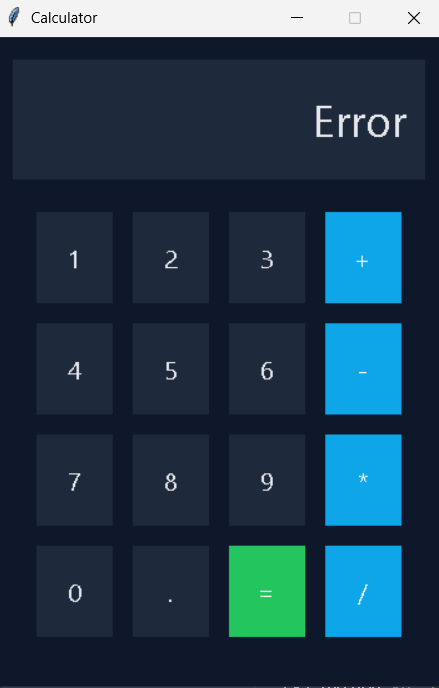

# 🧮 Tkinter Calculator (Python)

A simple yet elegant calculator application built using **Python & Tkinter**.
This project demonstrates both **core logic implementation** and **UI enhancement** using Tkinter widgets and styling.

---

## 🚀 Features

- Basic arithmetic operations (+, −, ×, ÷)
- Error handling (syntax & division errors)
- Clean and responsive UI
- Dark-themed modern design
- Beginner-friendly code structure

---

## 📂 Project Versions

- `calculator_basic.py`  
  A simple functional calculator focusing on core logic.

- `calculator_styled.py` ⭐  
  Improved version with modern colors, better layout, and enhanced UI  
  (**Recommended to run**)

---

## 📸 Screenshot




## ▶️ How to Run

```bash
python calculator_styled.py
